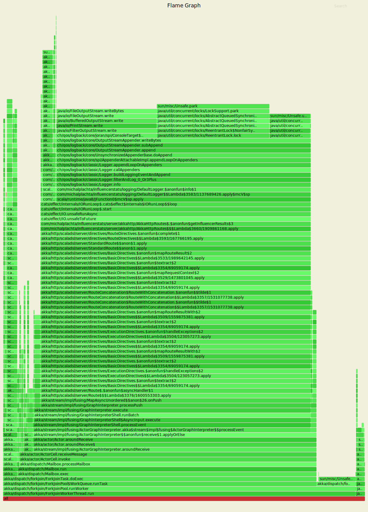
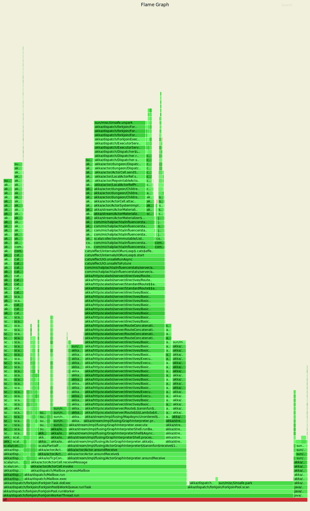
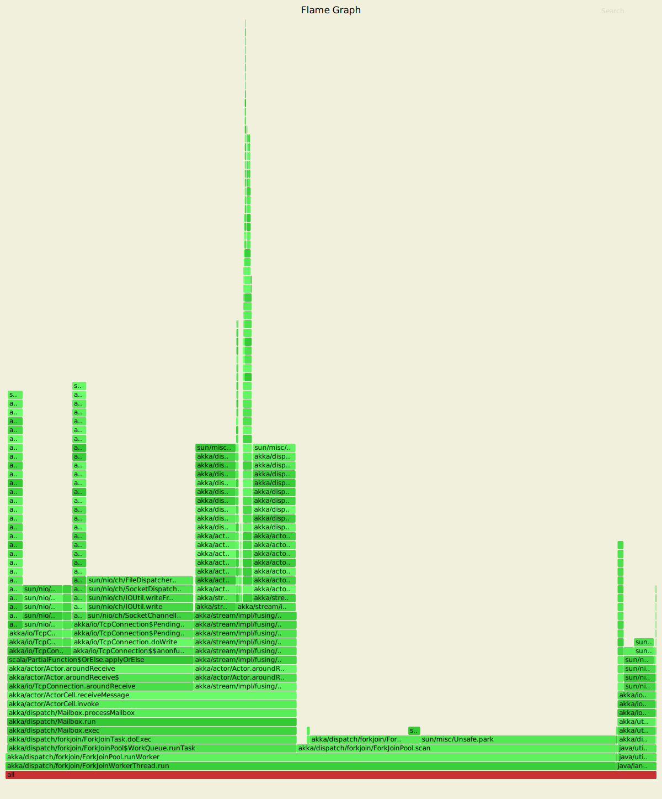
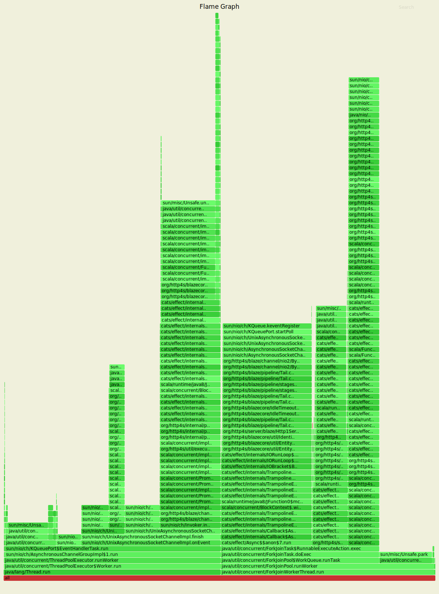

# Influencer Stats

This application gathers and aggregates stats for your influencer social media campaigns.

## Setup
### YouTube mock server
You need YouTube mock server to be able to test performance without going over YouTube API limits. To build the image, run `docker build -t miciek/influencer-stats-youtube youtube`. To run it, execute `docker run -d --rm --name youtube -p 8081:80 miciek/influencer-stats-youtube`.

### Running the application
After executing `sbt run`, you need to configure the first `collection`:

```
curl -XPUT -H "Content-Type: application/json" localhost:8080/collections/99757a95-f758-499f-a170-bea93b2d8bcf -d '{ "videos": [ "-4lB5EKS5Uk", "-jlLkTtgWUk", "1FEFpk-uIYo" ] }'
```

Then, you will be able to fetch the stats for videos in this `collection`:

```
curl localhost:8080/collections/99757a95-f758-499f-a170-bea93b2d8bcf/stats
```

## Performance tests
To run performance tests, you will need [wrk](https://github.com/wg/wrk). To analyse what's going on inside the application, please install [async-profiler](https://github.com/jvm-profiling-tools/async-profiler).

Before starting, let's first establish the performance of our YouTube mock server:

```
> wrk -t2 -c256 -d30s --latency http://localhost:8081/youtube/v3/videos
  Running 30s test @ http://localhost:8081/youtube/v3/videos
    2 threads and 256 connections
    Thread Stats   Avg      Stdev     Max   +/- Stdev
      Latency    11.86ms    2.10ms  44.67ms   95.00%
      Req/Sec    10.87k   614.63    12.14k    79.17%
    Latency Distribution
       50%   11.72ms
       75%   11.98ms
       90%   12.36ms
       99%   23.59ms
    649268 requests in 30.01s, 486.65MB read
    Socket errors: connect 0, read 124, write 0, timeout 0
  Requests/sec:  21634.72
  Transfer/sec:     16.22MB
```

Additionally, let's see what is the performance of collections with no videos (no additional requests to YouTube server are made):

```
wrk -t1 -c1 -d30s --latency http://localhost:8080/collections/39757a95-e758-499f-a170-bea93b2d8bca/stats
Running 30s test @ http://localhost:8080/collections/39757a95-e758-499f-a170-bea93b2d8bca/stats
  1 threads and 1 connections
  Thread Stats   Avg      Stdev     Max   +/- Stdev
    Latency   682.73us    3.35ms  47.60ms   97.16%
    Req/Sec     5.83k   776.99     6.53k    83.67%
  Latency Distribution
     50%  155.00us
     75%  164.00us
     90%  196.00us
     99%   21.81ms
  174201 requests in 30.01s, 29.41MB read
Requests/sec:   5804.37
Transfer/sec:      0.98MB
```

Remember that each test should be run several times to warm up JVM.

### Flamegraph generation
To compare different versions, we will use [flamegraphs](http://www.brendangregg.com/flamegraphs.html). The command below generates flamegraph for the load-tested application (should be started after around 10s of `wrk`):

```
jps # to get the <PID> of the application
cd async-profiler
./profiler.sh -d 10 -f /tmp/flamegraph.svg <PID>
```

Generated flamegraphs are stored in [flamegraphs](./flamegraphs) directory. Please view the flamegraphs as raw files in the browser, because only then they become interactive.

### Version 1 (DefaultLogger/InMemListState/AkkaHttpVideoClient/AkkaHttpServer)
```
> wrk -t1 -c16 -d30s --latency http://localhost:8080/collections/99757a95-f758-499f-a170-bea93b2d8bcf/stats
  Running 30s test @ http://localhost:8080/collections/99757a95-f758-499f-a170-bea93b2d8bcf/stats
    1 threads and 16 connections
    Thread Stats   Avg      Stdev     Max   +/- Stdev
      Latency    56.47ms    9.05ms 128.51ms   72.73%
      Req/Sec   284.33     31.34   353.00     72.33%
    Latency Distribution
       50%   56.03ms
       75%   61.61ms
       90%   66.89ms
       99%   82.41ms
    8510 requests in 30.06s, 1.54MB read
  Requests/sec:    283.12
  Transfer/sec:     52.53KB
```



According to the [flame graph](flamegraphs/v1.svg), the most performance can be gained from optimizing `DefaultLogger`, which took `70.29%` of CPU time.

### Version 2 (DroppingLogger/InMemListState/AkkaHttpVideoClient/AkkaHttpServer)
```
> wrk -t1 -c16 -d30s --latency http://localhost:8080/collections/99757a95-f758-499f-a170-bea93b2d8bcf/stats
  Running 30s test @ http://localhost:8080/collections/99757a95-f758-499f-a170-bea93b2d8bcf/stats
    1 threads and 16 connections
    Thread Stats   Avg      Stdev     Max   +/- Stdev
      Latency     6.94ms   10.49ms 151.46ms   95.37%
      Req/Sec     3.00k   565.78     3.79k    82.00%
    Latency Distribution
       50%    4.67ms
       75%    5.47ms
       90%    9.61ms
       99%   62.53ms
    89757 requests in 30.06s, 16.26MB read
  Requests/sec:   2986.26
  Transfer/sec:    554.09KB
```



According to the [flame graph](flamegraphs/v2.svg), the most performance can be gained from optimizing `fetchVideoListResponse`, which took `19.92%` of CPU time.

### Version 3 (DroppingLogger/InMemListState/HammockVideoClient/AkkaHttpServer)
```
> wrk -t1 -c16 -d30s --latency http://localhost:8080/collections/99757a95-f758-499f-a170-bea93b2d8bcf/stats
  Running 30s test @ http://localhost:8080/collections/99757a95-f758-499f-a170-bea93b2d8bcf/stats
    1 threads and 16 connections
    Thread Stats   Avg      Stdev     Max   +/- Stdev
      Latency     5.06ms    2.44ms  26.40ms   74.12%
      Req/Sec     3.24k   285.48     3.72k    62.00%
    Latency Distribution
       50%    4.55ms
       75%    6.22ms
       90%    8.25ms
       99%   13.05ms
    96564 requests in 30.00s, 17.50MB read
  Requests/sec:   3218.48
  Transfer/sec:    597.18KB
```


According to the [flame graph](flamegraphs/v3.svg), the most performance can be gained from optimizing `hammock/jvm/Interpreter`, which took `54.98%` of CPU time.

### Version 4 (DroppingLogger/InMemListState/HammockVideoClient/AkkaHttpServer/StatisticsCaching)
```
> wrk -t1 -c16 -d30s --latency http://localhost:8080/collections/99757a95-f758-499f-a170-bea93b2d8bcf/stats
  Running 30s test @ http://localhost:8080/collections/99757a95-f758-499f-a170-bea93b2d8bcf/stats
    1 threads and 16 connections
    Thread Stats   Avg      Stdev     Max   +/- Stdev
      Latency     2.87ms   11.63ms 144.63ms   94.76%
      Req/Sec    31.59k     7.02k   39.26k    84.35%
    Latency Distribution
       50%  346.00us
       75%  439.00us
       90%    1.74ms
       99%   62.86ms
    933303 requests in 30.03s, 169.11MB read
  Requests/sec:  31081.81
  Transfer/sec:      5.63MB
```



According to the [flame graph](flamegraphs/v4.svg), the most performance can be gained from optimizing the server which takes all the CPU time.

### Version 5 (DroppingLogger/InMemListState/HammockVideoClient/Http4sServer/StatisticsCaching)
```
> wrk -t1 -c16 -d30s --latency http://localhost:8080/collections/99757a95-f758-499f-a170-bea93b2d8bcf/stats
  Running 30s test @ http://localhost:8080/collections/99757a95-f758-499f-a170-bea93b2d8bcf/stats
    1 threads and 16 connections
    Thread Stats   Avg      Stdev     Max   +/- Stdev
      Latency   555.80us    1.38ms  17.53ms   96.68%
      Req/Sec    38.79k     3.46k   48.66k    68.67%
    Latency Distribution
       50%  314.00us
       75%  396.00us
       90%  485.00us
       99%    9.05ms
    1158664 requests in 30.02s, 181.22MB read
  Requests/sec:  38596.24
  Transfer/sec:      6.04MB
```



### Version 1 with real YouTube server
I run the first version (the worst performant one) with real YouTube API and here are the results. We can compare them to get a network overhead:
```
> wrk -t1 -c16 -d30s --latency http://localhost:8080/collections/99757a95-f758-499f-a170-bea93b2d8bcf/stats
  Running 30s test @ http://localhost:8080/collections/99757a95-f758-499f-a170-bea93b2d8bcf/stats
    1 threads and 16 connections
    Thread Stats   Avg      Stdev     Max   +/- Stdev
      Latency   393.60ms  173.80ms   1.24s    85.57%
      Req/Sec    44.59     24.01   125.00     57.66%
    Latency Distribution
       50%  362.83ms
       75%  419.28ms
       90%  579.63ms
       99%    1.09s
    1239 requests in 30.04s, 219.00KB read
    Socket errors: connect 0, read 0, write 0, timeout 1
  Requests/sec:     41.25
  Transfer/sec:      7.29KB
```